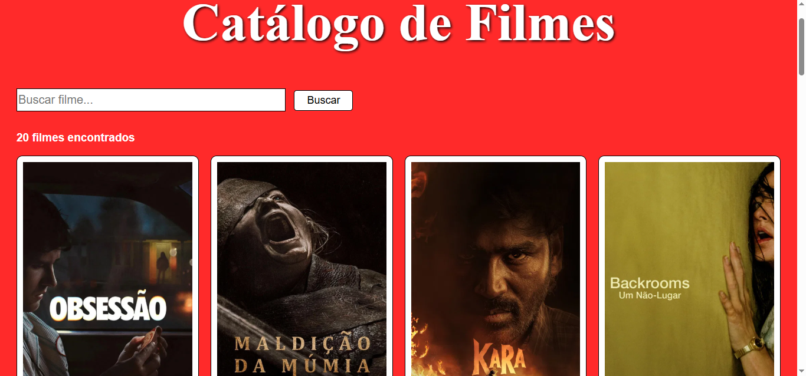

# Movie Browser

Aplicação web que consome a API do TMDB para pesquisa e visualização de filmes, exibindo pôster, nota, ano de lançamento e sinopse em uma interface responsiva.

## 🚀 Funcionalidades

- Listagem de filmes
- Busca por título
- Visualização de detalhes do filme
- Interface responsiva
- Consumo de dados via API (JSON Server / backend próprio)

## 🛠️ Tecnologias utilizadas

- HTML5
- CSS3
- JavaScript (ES6+)
- Fetch API
- JSON Server (caso use)
- Git & GitHub

## 📦 Como executar o projeto

### 1. Clonar o repositório

git clone https://github.com/seu-usuario/movie-catalog.git

## Prints do trabalho

