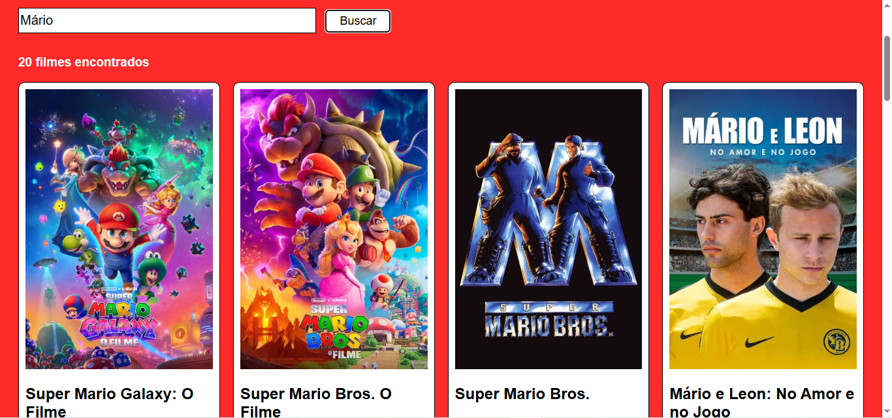

# Trabalho Prático - Semana 12

Nesta atividade, vamos trabalhar com uma API de mercado para montar uma interface de visualização de filmes. Para isso, vamos utilizar a [The Movie Database (TMDB) API](https://developer.themoviedb.org/docs/getting-started). A página resultante deve listar os resultados de uma requisição HTTP em formato de cards e deve incluir uma funcionalidade de pesquisa ou filtro. 

## Informações Gerais

- Nome: Victor Fernandes dos Santos
- Matrícula: 928768

## Breve descrição do fluxo "requisição → tratamento → renderização"

Ao carregar a página ou realizar uma busca, é feita uma requisição à API utilizando a Fetch API para obter os dados dos filmes. Em seguida, a resposta é convertida para JSON e tratada pelo JavaScript, extraindo as informações necessárias. Depois os dados são renderizados na tela por meio da criação dinâmica de cards contendo pôster, título, ano, nota e sinopse dos filmes.

## Prints do trabalho

